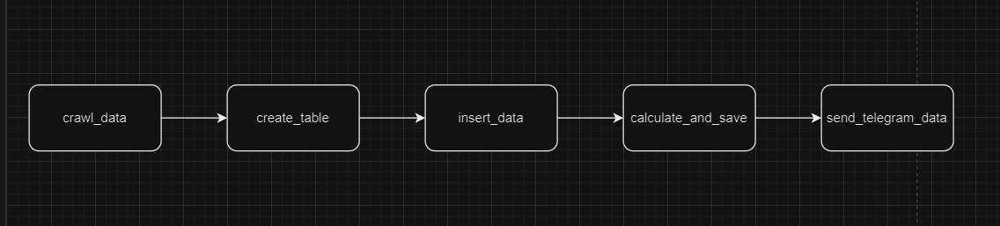
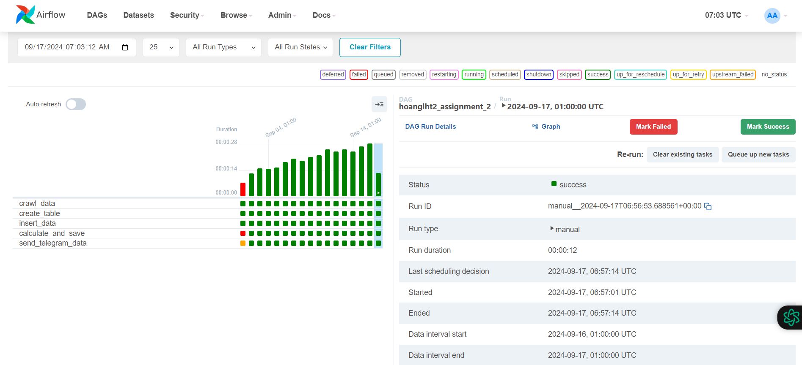

Phần 1: Vẽ DAG trên draw.io

Phần 2: Giải pháp

Tạo DAG trên Airflow với 5 task:

Task 1: Lấy dữ liệu từ APILayer với toàn bộ symbols và base là USD từ ngày 2024-09-01 đến 2024-09-17.
Sử dụng thư viện request để lấy dữ liệu từ API và sử dụng backfill để lấy dữ liệu từ ngày trong quá khứ.

Task 2: Tạo kết nối với Postgres và tạo bảng để chứa dữ liệu lấy về.
Bảng bao gồm 3 cột:

- rate_symbols là ký hiệu của đồng đó
- rate_values là giá trị của đồng coin
- rate_date là ngày lấy giá trị

Task 3: Nhập toàn bộ dữ liệu đã lấy ở task 1 vào bảng đã tạo ở task 2.

Task 4: Sử dụng thư viện pandas để xử lý dữ liệu đã lấy được từ APILayer và lưu kết quả thành file csv tại local.
Bảng trả về bao gồm các giá trị biên độ lệch lớn nhất của rate_values trên mỗi rate_symbols và cả ngày đem ra so sánh
với ngày gốc.

- rate_date_x là ngày gốc
- rate_symbols là ký hiệu của đồng coin
- rate_date_y là ngày có biên độ lệch lớn nhất so với ngày gốc
- rate_values_diff là biên độ lệch của ngày gốc với ngày được so sánh

Task 5: Gửi kết quả phân tích lên Telegram. Đầu tiên ta cần tạo một bot từ BotFather sau đó thêm channel và thêm bot vào
channel vừa tạo. Sau đó gọi API để gửi kết quả dưới dạng csv lên channel đã tạo thông qua chat_id và bot_token. Cách lấy
có thể tham khảo trong link sau:
https://fcwordpress.net/huong-dan-lay-bottoken-va-chatid-cua-bot-telegram.html

Phần 3: Output DAG

